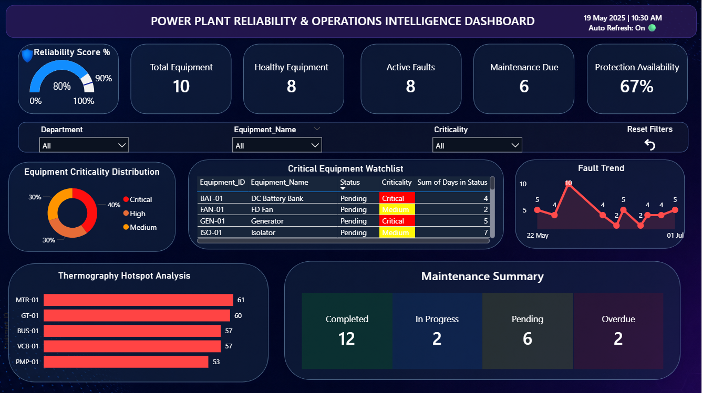
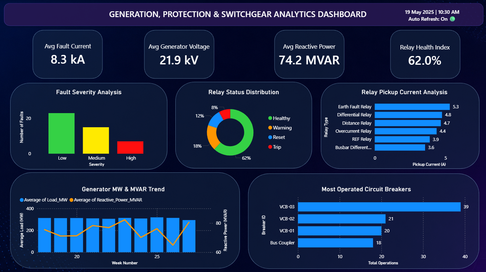

# Power Plant Reliability and Operations Analytics Dashboard

## Overview

This project presents a Power BI dashboard developed for monitoring reliability, maintenance performance, electrical protection systems, and generator operation in a thermal power plant environment.

The dashboard combines maintenance, thermography, fault analysis, protection system monitoring, and generator performance analytics into a unified reporting solution. The objective is to provide engineers and plant personnel with actionable insights for equipment reliability assessment and operational decision-making.

---

## Project Objectives

- Monitor equipment reliability and health status
- Track maintenance activities and open issues
- Analyze thermography hotspot data
- Monitor protection relay performance
- Evaluate generator operating parameters
- Analyze fault occurrence and severity
- Support maintenance and operational planning

---

## Dashboard Structure

### Page 1: Reliability and Operations Dashboard

#### Key Performance Indicators

- Reliability Score
- Total Equipment
- Healthy Equipment
- Active Faults
- Maintenance Due
- Protection Availability

#### Visualizations

- Equipment Criticality Distribution
- Critical Equipment Watchlist
- Maintenance Status Summary
- Fault Trend Analysis
- Thermography Hotspot Analysis

---

### Page 2: Electrical Protection and Generation Analytics Dashboard

#### Key Performance Indicators

- Average Fault Current
- Average Generator Voltage
- Average Reactive Power
- Relay Health Index

#### Visualizations

- Relay Status Distribution
- Fault Severity Analysis
- Generator MW and MVAR Trend
- Relay Pickup Current Analysis
- Circuit Breaker Operation Ranking

---

## Tools and Technologies

- Microsoft Power BI
- Power Query
- DAX
- Microsoft Excel

---

## Engineering Concepts Applied

### Reliability and Maintenance

- Equipment Health Monitoring
- Reliability Assessment
- Asset Criticality Analysis
- Maintenance Performance Tracking

### Electrical Protection

- Protection Relay Monitoring
- Fault Current Analysis
- Relay Pickup Current Evaluation

### Power System Operation

- Active Power Monitoring
- Reactive Power Monitoring
- Generator Voltage Analysis
- AVR Performance Assessment

### Switchgear and Protection

- Circuit Breaker Utilization Analysis
- Protection System Performance Monitoring
- Fault Severity Classification

---

## Dashboard Screenshots

### Reliability and Operations Dashboard



### Electrical Protection and Generation Analytics Dashboard



---

## Repository Structure

```text
power-plant-reliability-dashboard
│
├── Dashboard.pbix
├── README.md
│
├── screenshots
│   ├── Page1_Reliability_Dashboard.png
│   └── Page2_Protection_Analytics.png
│
├── data
│   └── PowerPlant_Dataset.xlsx
│
└── docs
    └── Project_Report.pdf
```

---

## Key Outcomes

- Developed an integrated Power BI dashboard for plant reliability and operational monitoring.
- Created DAX-based KPIs for reliability, maintenance, protection, and generation performance.
- Implemented data transformation and modeling using Power Query.
- Designed interactive visualizations for maintenance analytics, fault monitoring, thermography analysis, protection systems, and generator performance.

---

## Author

Dhairya Bhatt

B.Tech, Electrical Engineering  
Sardar Vallabhbhai National Institute of Technology (SVNIT), Surat
